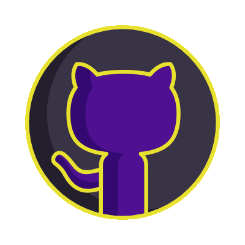
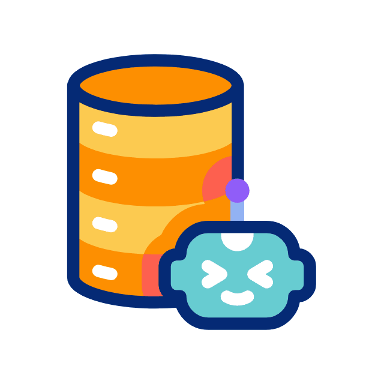
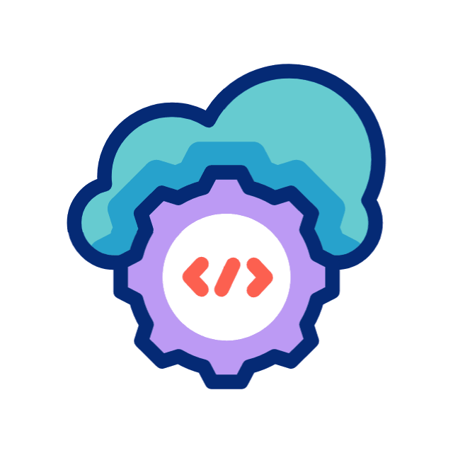
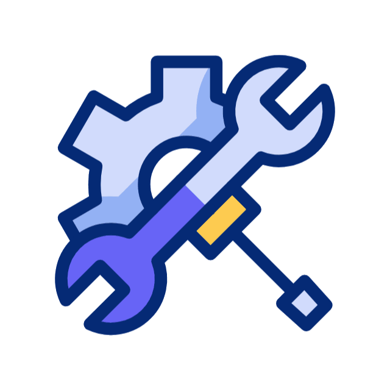

  

  

 

<h1 align="center">
   
  Hi there, I'm Andrew Alca 
  
</h1>

  

  

  <h3>
     
    Let's Connect
  </h3>
  
  <table width="100%">
    <tr>
      <th width="50%">
💼 Professional Links
</th>
      <th width="50%">
👾 Community & Social
</th>
    </tr>
    <tr>
      <td align="center">
        <nobr>
          
          &nbsp;&nbsp;&nbsp;
          
          &nbsp;&nbsp;&nbsp;
          
        </nobr>
      </td>
      <td align="center">
        <nobr>
          
          &nbsp;&nbsp;&nbsp;
          
          &nbsp;&nbsp;&nbsp;
          
        </nobr>
      </td>
    </tr>
  </table>

 

  
  
  

    Transitioning the analytical mindset of Mechanical Engineering into building reliable and efficient backend systems.
    Currently strengthening my skills in <b>Backend Development</b>, while exploring the fundamentals of 
    <b>AI & Machine Learning</b> and getting started with <b>cloud technologies</b> to grow into a well-rounded 
    Full-Stack Developer.
  

  <ul>
    <li>🏢 <b>Experience:</b> Software Developer Intern at <b>Tecsup</b> | Previously at <b>Oracle Perú SAC</b>.</li>
    <li>💻 <b>Current Focus:</b> Backend Development (Java, Spring, Python).</li>
    <li>🧠 <b>Learning Path:</b> Fundamentals of AI & Machine Learning, cloud basics, and containerization with <b>Docker</b> (Kubernetes upcoming).</li>
    <li>🚀 <b>Goal:</b> Contribute to impactful projects where clean code, solid logic, and engineering principles drive scalable solutions.</li>
  </ul>

 

  

<h3 align="center">
   
  Tech Stack & Tools
  
</h3>

  <table>
    <tr>
      <td align="center" rowspan="3" width="25%">
        
           
      </td>
      <td align="center" width="37%">
        <b> Programming Languages </b>   
        
      </td>
      <td align="center" width="37%">
        <b> Frameworks & Libraries </b>  
        
      </td>
    </tr>
    <tr>
      <td align="center" width="37%">
        <b> Databases </b>  
        
      </td>
      <td align="center" width="37%">
        <b> Cloud & DevOps </b>  
        
      </td>
    </tr>
    <tr>
      <td align="center" colspan="2">
        <b> Tools & Workflow </b>  
        
         
        
        
      </td>
    </tr>
  </table>

  

<h3 align="center">
   
  GitHub Analytics 
  
</h3>

  
  
  
    
  <table>
    <tr>
      <td align="center" width="55%">
        
      </td>
      <td align="center" width="60%">
        
      </td>
    </tr>
  </table>
   
  

 

  <picture>
    <source media="(prefers-color-scheme: dark)" srcset="https://raw.githubusercontent.com/AndrewMechDev/AndrewMechDev/output/pacman-contribution-graph-dark.svg">
    <source media="(prefers-color-scheme: light)" srcset="https://raw.githubusercontent.com/AndrewMechDev/AndrewMechDev/output/pacman-contribution-graph.svg">
    
  </picture>

  

 

  

 

  

  

